```{r setup, include=FALSE}
knitr::opts_chunk$set(echo = FALSE)
```

---

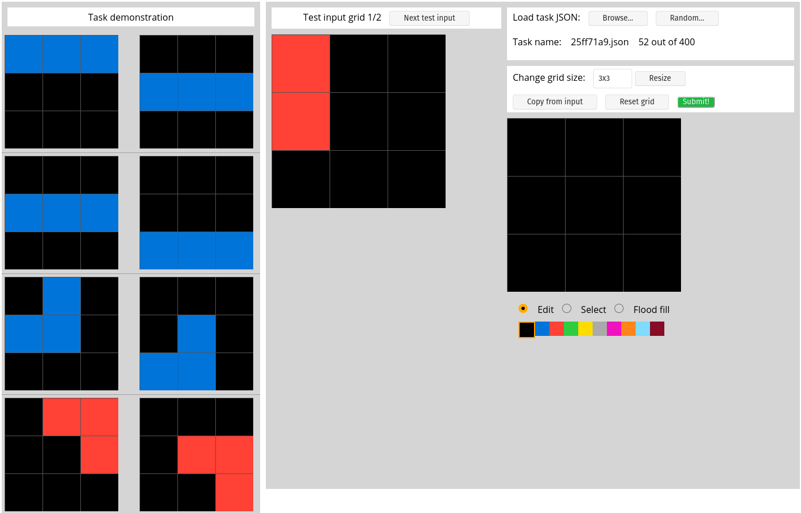

---

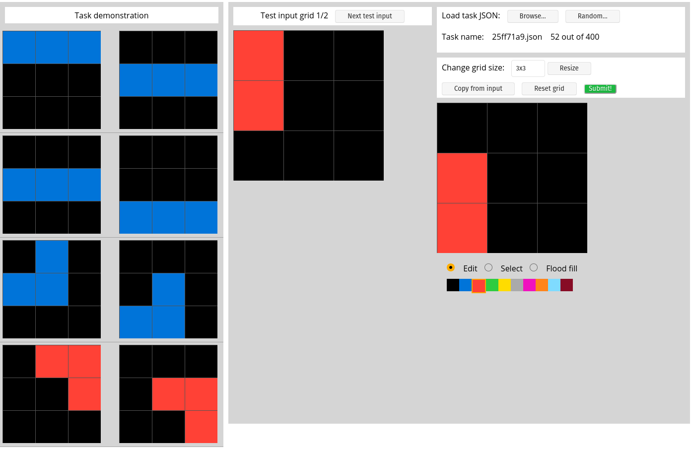

## Table of Contents

 - What is the goal of this competition?
 - **What is intelligence?**
 - The Abstraction and Reasoning Corpus (ARC)
 - Kaggle Solutions

<aside class="notes">
This competition is different from any other. We will spend most of the time discussing the philosophy of the dataset instead of the solutions.
</aside>

## What is the goal of Abstraction and Reasoning Corpus (ARC)?

<div id="left">
> The Abstraction and Reasoning Corpus (ARC) provides a benchmark to measure AI skill-acquisition on unknown tasks, with the constraint that only a handful of demonstrations are shown to learn a complex task. It provides a glimpse of a future where AI could quickly learn to solve new problems on its own.
</div>

<div id="right">

</div>

## What percentage of the problems in ARC test set were solved by the 1st place AI? 

## What is the goal of AI Research?

> AI is the science of making machines capable of performing tasks that would require intelligence if done by humans. - Marvin Minsky

<aside class="notes">
Notice is a pretty circular argument. How would we test this?
</aside>


## Weaknesses of Current AI Research Approach

<div id="left">
 - Current algorithms are narrow and data hungry
 - Famous AI competitions like the Turing Test rely on human judges
 - Lack of agreement biases research to narrow, well defined skills
</div>

<div id="right">

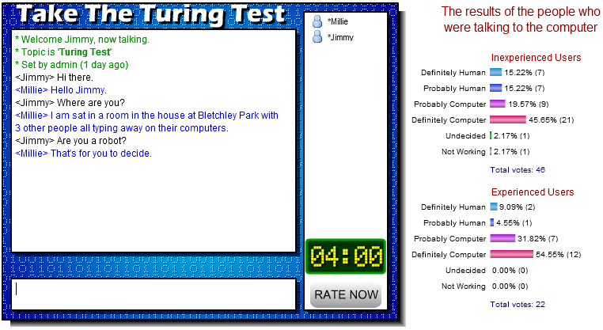
</div>

## Defining Intelligence Currently

> Intelligence measures an agent’s ability to *achieve goals* in a *wide range of environments*. 
- Legg and Hutter

1. Achieve goals 
2. Wide range of environments (Adaptability and Generalization)

Chollet's argument: We've spent too much time on the first part!

## Measuring the right thing

<div id="left">
- If the real world is a chaotic system, we need to optimize for adaptability
- DeepBlue didn't get us much closer to AGI
- Neither did the latest reinforcement learning algorithms
- Often, these challenges measure the ML engineer's intelligence, not the system itself
</div>

<div id="right">
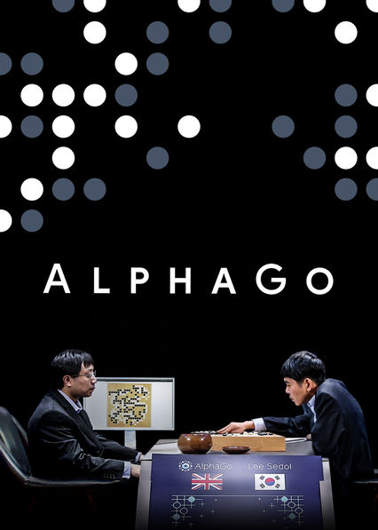
</div>

<aside class="notes">

- Note that a k-nearest neighbour algorithm can solve any task, given enough data
</aside>

## Current trends in AGI evaluation: Reinforcement Learning (RL)

<div id="left">
- Most RL tests don't measure robustness
- RL can sample arbitrary amounts of data
- Brittle to exploits
</div>

<div id="right">
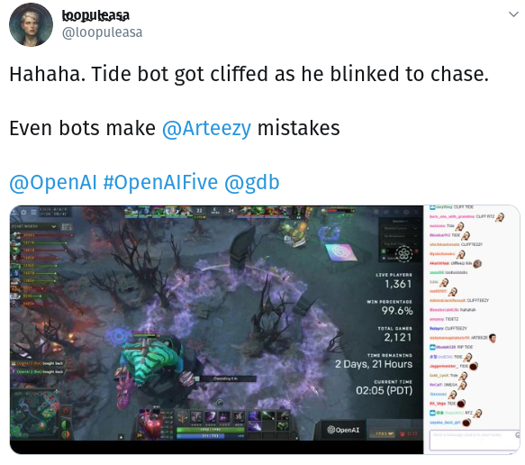
</div>

<aside class="notes">
This tweet is saying that one of OpenAI DOTA bots can be tricked into teleporting onto a ledge it can't get down from
</aside>

## AI Effect

> "Every time somebody figured out how to make a computer do something...there was a chorus of critics to say 'that's not thinking" - Pamela McCorduck

## What would a good AI adaptability benchmark have?

  - Reproducibility
  - Fairness
  - Scalability
  - Flexibility/Generalization

## Two ways of thinking about generalization


<div id="left">
#### System-centric generalization

- Most machine learning is here
- The developer tries to compensate for data not in the dataset
- Known unknowns
</div>

<div id="right">
#### Developer-aware generalization

- Generalizations beyond what the developer expected
- Unknown unknowns
</div>

<aside class="notes">
The game of Go never changes. What would happen if we changed the size of the board?
</aside>

---


## The generalization spectrum

 1. **Absence of generalization:** Classical algorithms. No uncertainty.
 2. **Local generalization:** Most machine learning
 3. **Broad generalization:** Wozniak's coffee cup challenge
 4. **Extreme generalization:** Human-level intelligence


## Psychometrics Perspective

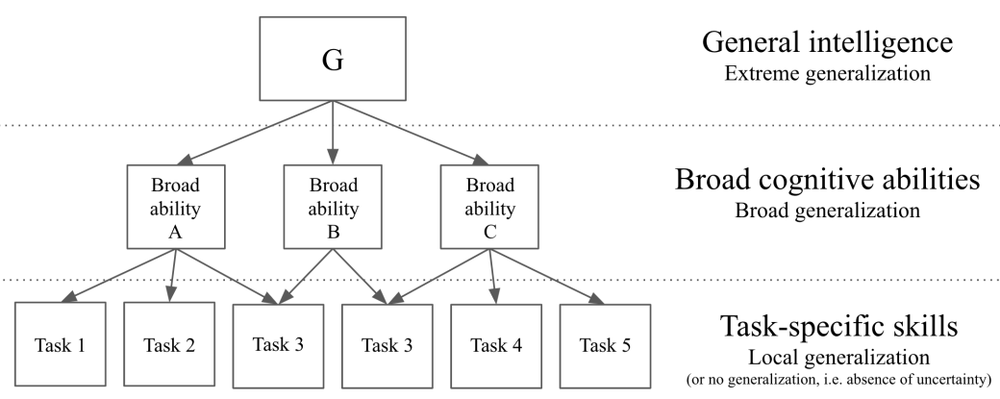

<aside class="notes">
- There's a whole field dedicated to measuring intelligence called psychometrics
</aside>

## G Factor

- Think of G Factor like general athleticism
- There are limits to athletic measurement, we wouldn't measure humans at the bottom of the ocean or on Mars
- Humans are incredible efficient at solving 2D and 3D problems but we are terrible at 4D+ problems

<aside class="notes">
- IQ tests are very human-centric
- Why not consider octopus camouflage intelligence?
</aside>

## Principles of an AGI Test

- Measure abilities, not skills
- Use a battery of tests
- Set standards on reliability and validity
- Remove the need for human-level knowledge
- Focus on skill acquisition efficiency

## Human Priors

- To compare intelligence we need to control for experience, priors and the difficulty of the task
- Human intelligence is not hard-coded, but we also aren't blank slates
- Some human priors:
    - Reflexes (uninteresting to us for this challenge)
    - Metalearning priors (These are the priors we are trying to reverse engineer)
    - High level knowledge priors (e.g. object permanence)

## Priors

- We should make the machine priors as close to human priors as possible
- The less priors you have, the more disadvantaged the machine is
- **All priors should be enumerated**

## ARC Priors

- **Objectness and elementary physics**
    - Object recognition
    - Cohesion
    - Persistence
    - Contact

- Agency
    - Some objects seem to react to their environment (like avoiding walls)
    - Some objects seem to react to other objects (a pip following another pip)

- Natural numbers up to 10
    - Comparison/Sorting
    - Addition and subtraction

- Geometry/Topology
    - Symmetry
    - Orientation
    - In/Out relationships

## Contactness

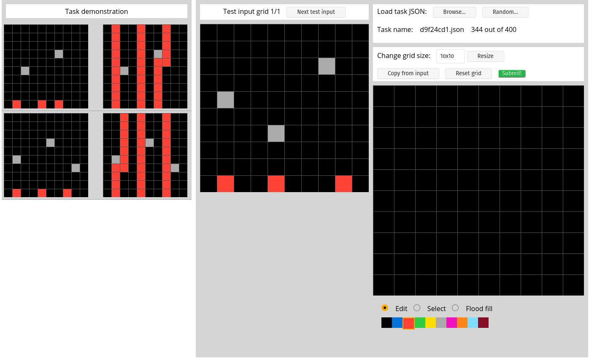

## Contact/Goal-Directedness

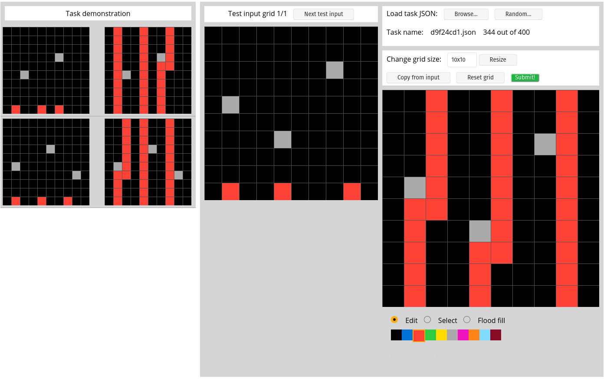

## Distance/In-Out Relationtionship

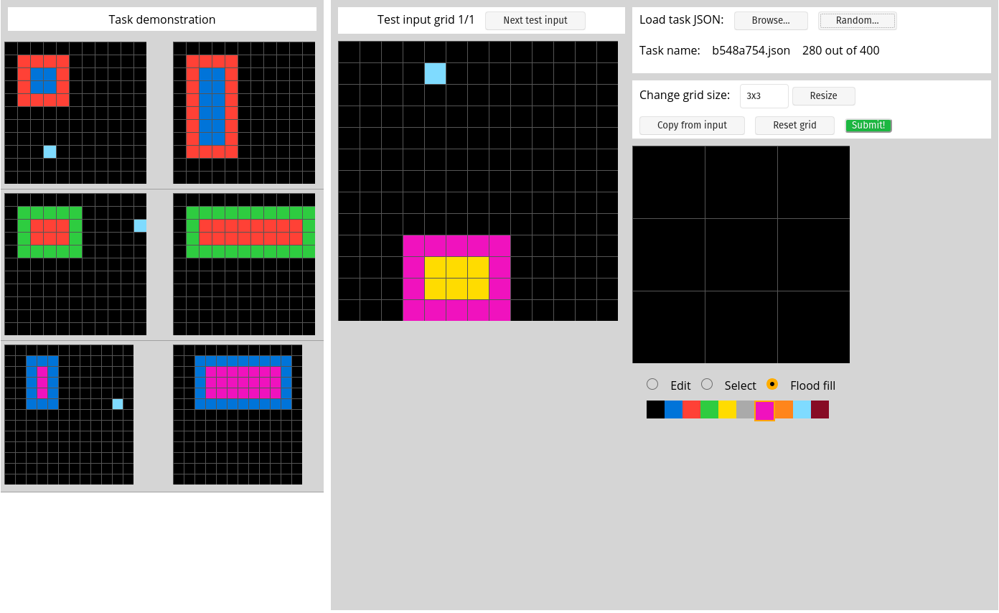

## Distance/In-Out Relationtionship

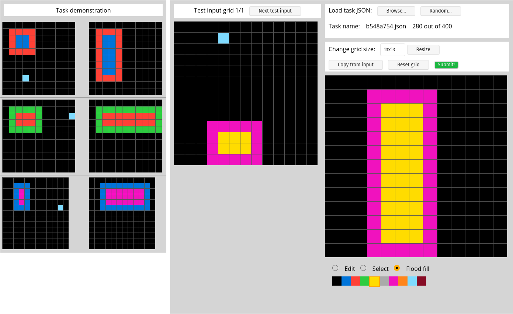

## Object Persistence and Size Comparison

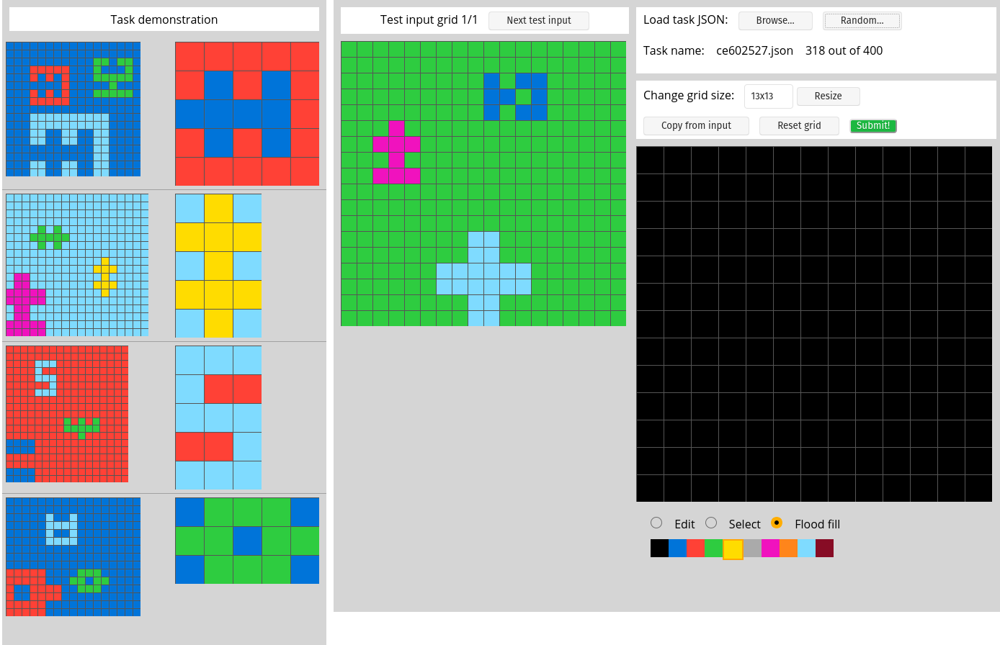

## Object Persistence and Size Comparison

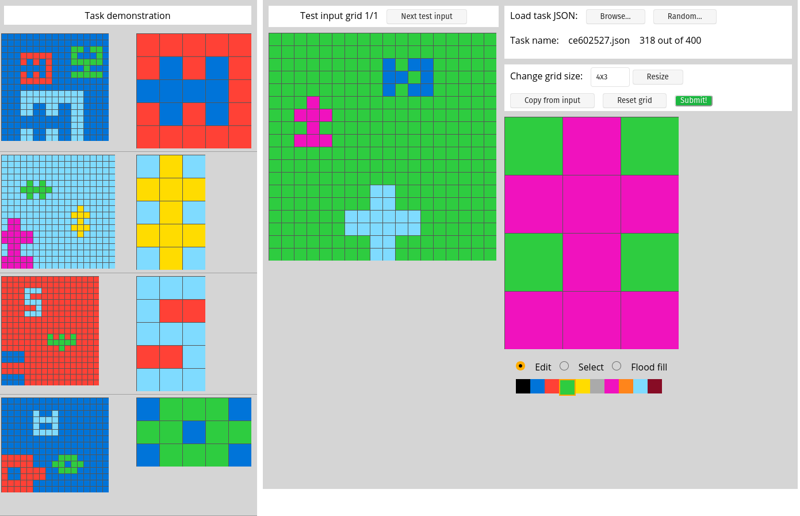


## Francois Chollet's Definition of Intelligence

> The intelligence of a system is a measure of it's skill acquisition efficiency over a scope of tasks with respect to priors, experience, and generalization difficulty

$$I_{I S, s c o p e}^{\theta_{T}}=\underset{T \in s c o p e}{A v g}\left[\omega_{T} \cdot \theta_{T} \sum_{C \in C u r_{T}^{\theta_{T}}}\left[P_{C} \cdot \frac{G D_{I S, T, C}^{\theta_{T}}}{P_{I S, T}^{\theta_{T}}+E_{I S, T, C}^{\theta_{T}}}\right]\right]$$


## How do we measure this type of intelligence

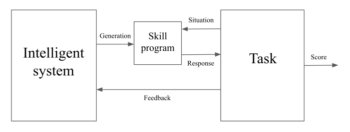

<aside class="notes">
- This is a different way of thinking about machine learning
- In training, the machine learning model is constant producing skill programs and the task is responding to the skill program itself
- For example, a neural network produces arrays of numbers (the skill program) and the task will give feedback (in the form of gradients) based on the skill programs response
</aside>

## The Evaluation Phase

- The Intelligent System (IS) creates a skill program and then can no longer interact with the system

In ARC:

- ARC gets three tries to create a skill program for each task

## Implications of the Intelligence Definition

- Creating an intelligent system can be seen as an optimization problem
- Focus on skill acquisition efficiency
- Defines generalization levels
- Can compare humans to AI

## The ARC Dataset

- Developer-aware
- Experience Controlled
- Priors enumerated
- 400 training tasks/400 public evaluations/200 private

## ARC test description

- Up to 10 unique symbols/colors
- Size from 1x1 to 30x30
- Usually 3 trials per test
- A typical human can solve most ARC problems with no previous training
- At least 1 and 3 high IQ humans were able to solve each task

## Differences with Psychometric Tests

- No crystallized knowledge (like NLP or object recognition)
- ARC challenges are not generated programmatically

## What would a possible intelligent system look like?

- Need more human data for a fair comparison
- Deep learning won't work here
- Program synthesis important
- Make a Domain Specific Language (DSL) to describe all possible situations
- Generate candidate programs
- Select top 3 candidates

## ARC Weaknesses & Future Refinement

- ARC solve could have human-like intelligent, or not!
- Generalization difficult not quantified
- Test validity not established
- Dataset diversity is limited
- Evaluation is overly close-ended
- Priors may not be well captured in ARC

## The Kaggle competition

 - 20k in prize money
 - Chollet would be surprised if 20% of tasks in the private set were solved
 
## 1st place by Johan Sokrates Wind

 - 20.6% solved
 - Implemented the first 100 training tasks by hand, chunking the solutions into useful functions
 - Made a domain specific language (DSL) and >10k of C++ code multihreaded
 - Used a directed acyclic graph to compose combinations together

## 2nd place by Alejandro de Miquel Bleier, Roderic Guigo Corominas and Yuji Ariyasu
 
 - 19.7% solved
 - Was less than 2% solved for the first 6 weeks
 - Used a short of guided evolution strategy, applying random operations in the training loop and keeping the top 3 results
 - Correctness was based on pixel-wise distance

## When do you think an algorithm will outperform humans on ARC?

## Bibliography
